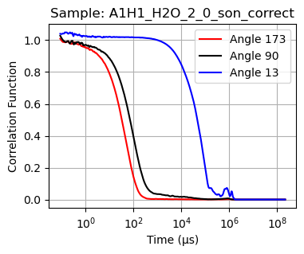
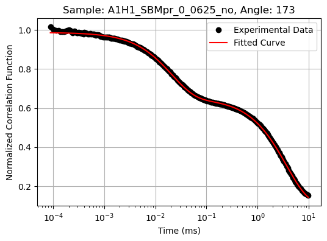
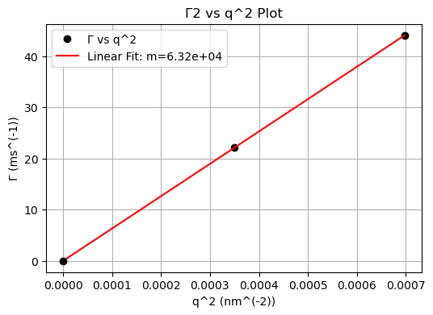

# Dynamic-Light-Scattering-Data-Modeling
Software and useful python tools for data processing and analysis of Multi-angle Dynamic Light Scattering data (from ZetaSizer or other instruments)

   
  
  
  

   
Multi-angle Dynamic Light Scattering (MA-DLS) software and tools is a Python package containing mostly jupyter notebooks that enables:
1. Reading of the exported data from a ZetaSizer (Malvern Panalytical) DLS instrument (or other DLS instruments) and create seperate .txt files for each angle and sample
2. Normalization and fitting of the experimental correlation function via two possible models: i. non-linear iteration model (cumulants) and ii. bi-exponential in the desired τ range. Capability to export the fitting curves for each sample and angle.
3. User defined constants and system parameters such as temperature, solvent viscosity, refractive index etc.
4. Calculation of diffusion coefficient, hydrodynamic radius and storage of all the fitting results for each sample and angle into a single table. The average results are also exported in an output data sheet. 
5. Integrated algorithm for the calculation of uncertainty propagation into the final results
6. User selection of the number of the angles that will be used for averaging. Evaluation of the robustness of the fitting using the linear curve of Γ-q^2 for each angle
   

- **Bugs** dsapalidis@gmail.com

